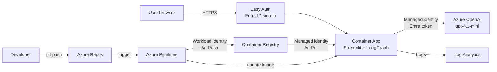

# langagent – Language Practice Multi-Agent

A multi-agent app for practising a foreign language, deployed to Azure the way an enterprise internal app would be: containerised, keyless, behind company sign-in, and shipped through a CI/CD pipeline.

A **supervisor** agent reads each message and routes it to one of four specialists:

| Agent | Handles |
|---|---|
| `writing_corrector` | Your own text (e.g. a diary entry) to correct |
| `vocab` | "What does X mean?" / "How do I say Y?" |
| `grammar_teacher` | Explaining a grammar topic |
| `quiz` | Creating a quiz, and grading your answers |

Built with **LangGraph** and **Streamlit**, running on **Azure Container Apps** with **Azure OpenAI**.

---

## Architecture



| Layer | Azure service | Notes |
|---|---|---|
| Runtime | Azure Container Apps | Scales to zero when idle |
| Image | Azure Container Registry | One image, promoted across environments |
| Model | Azure OpenAI (`chat-mini` → gpt-4.1-mini) | API keys disabled, Entra ID only |
| Identity | User-assigned managed identity | No secrets in code or config |
| Sign-in | Container Apps authentication (Entra ID) | Single tenant, assignment required |
| Observability | Log Analytics | Container logs incl. supervisor routing decisions |
| CI/CD | Azure Repos + Azure Pipelines | Build on push to `main`, deploy to dev |

### Resource layout

```
Subscription
├─ rg-langagent-shared   Container Registry, Log Analytics, Azure OpenAI
├─ rg-langagent-dev      Container Apps environment, managed identity, Container App
├─ rg-langagent-test     (reserved for automated evaluation)
└─ rg-langagent-prod     (planned)
```

---

## Security design

The whole chain runs **without a single stored secret**.

| Who | Accesses | How | Role |
|---|---|---|---|
| App (managed identity) | Container Registry | Entra token | AcrPull |
| App (managed identity) | Azure OpenAI | Entra token | Cognitive Services OpenAI User |
| Pipeline (workload identity federation) | Container Registry | Federated token | AcrPush |
| Pipeline (workload identity federation) | Dev resource group | Federated token | Contributor (dev only) |
| Developers group | Azure OpenAI (local testing) | `az login` | Cognitive Services OpenAI User |
| End users | The app | Entra sign-in | Enterprise app assignment |

Principles applied:

- **Least privilege**: each identity only gets the role it needs, on the narrowest scope
- **Separation of duties**: developers manage dev only; prod and shared resources belong to the platform admin; pipelines need admin approval before using a service connection
- **Management vs. data plane**: subscription Owner can manage the model resource but cannot call it
- **App access ≠ resource access**: Azure RBAC controls who can *change* the app; Entra app assignment controls who can *use* it

---

## CI/CD

`azure-pipelines.yml` runs on every push to `main`:

1. **Build** – builds the image on a Microsoft-hosted Linux agent and pushes it to ACR, tagged with the build ID
2. **DeployDev** – updates the dev Container App to the new image (tracked as the `dev` environment in Azure DevOps)

Prompts live in the code, so prompt changes are versioned and deployed through the same pipeline ("prompt as code").

---

## Project structure

```
agent.py              # graph: supervisor + 4 specialists, model setup
app.py                # Streamlit chat UI
Dockerfile            # container image (Python 3.14, non-root user)
.dockerignore
azure-pipelines.yml   # CI/CD pipeline
requirements.txt
.env.example          # configuration template (copy to .env, never commit .env)
```

---

## Run locally

```bash
python3 -m venv .venv
source .venv/bin/activate
pip install -r requirements.txt
cp .env.example .env
az login                      # an account with "Cognitive Services OpenAI User" on the model
python -m streamlit run app.py
```

Or as a container:

```bash
docker build --platform linux/amd64 -t langagent:local .
docker run --rm -p 8501:8501 --env-file .env langagent:local
```

Locally the app authenticates with your `az login` identity; in Azure it uses the managed identity. The code is identical in both cases (`DefaultAzureCredential`).

## Configuration

| Variable | Purpose |
|---|---|
| `LLM_PROVIDER` | `azure` (default) or `anthropic` (local fallback) |
| `AZURE_OPENAI_ENDPOINT` | Azure OpenAI endpoint |
| `AZURE_OPENAI_DEPLOYMENT` | Model deployment name (`chat-mini`) |
| `AZURE_OPENAI_API_VERSION` | API version |
| `AZURE_CLIENT_ID` | Set in Azure only: which managed identity to use |

---

## Status and roadmap

- [x] Local app (LangGraph + Streamlit)
- [x] Containerised
- [x] Azure OpenAI with Entra ID auth, keys disabled
- [x] Dev environment on Container Apps with managed identity
- [x] Entra sign-in, access by user assignment
- [x] CI/CD: build and deploy to dev on push
- [ ] Branch policy: pull request + reviewer for `main`
- [ ] Prod environment with approval gate
- [ ] Per-user conversation memory, persisted outside the container
- [ ] Test environment with automated agent evaluation (routing accuracy, answer quality)
- [ ] Infrastructure as code (Bicep)
